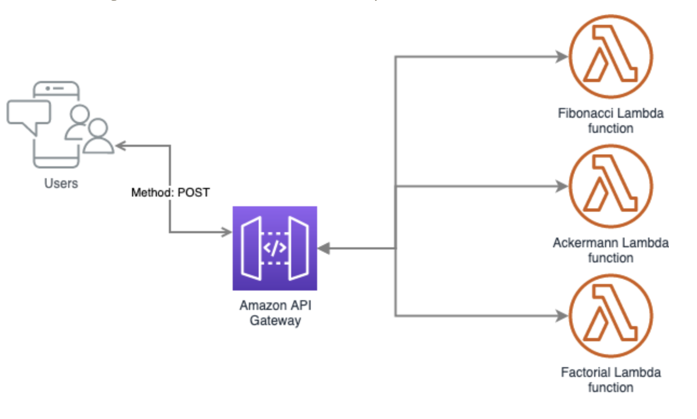

### Overview
Implement a web service in the language and framework of your choice, which calculate and display results for the following algorithms:
- Calculating a Fibonacci number F(n) with the value of n provided by the user.
- The Ackermann function A(m,n) with values of m and n provided by the user.
- The factorial of a non-negative integer n provided by the user.

Design and write the optimised versions of the 3 functions you have already implemented and make them available via different endpoints.
The second part is to provide monitoring for your application where you will monitor the
metrics you deem important from an operational and optimisation aspect.
### Goals
Create  Infrastructure as Code (IaC) to monitor and deploy three endpoint to calculate:
Calculating a Fibonacci number F(n) with the value of n provided by the user.
The Ackermann function A(m,n) with values of m and n provided by the user.
The factorial of a non-negative integer n provided by the user.
Specifications
To program, deploy  and monitor our solution we choose the following technologies:

- Amazon AWS Lambda
- Amazon AWS API Gateway
- Amazon AWS S3
- Amazon AWS IAM
- Amazon AWS Cloudwatch
- Terraform > = 0.12
- Python 2.7

### Diagram
Here is the diagram where we can see how the request arrived at the lambda function.


Each of our endpoints triggers a different Lambda function. These functions are independent of one another and can be written in any language supported by AWS, in our case they are written in Python. Thereby leading to scaling at function level, easier unit testing, and loose coupling.
All requests from clients first go through the API Gateway and then routes the incoming request to the right Lambda function accordingly.

### Infrastructure
To deploy the entire infrastructure we use Terraform.
The structure of the folder is the following:
- `application`: Here we put the application zip file to deploy in lambda.
- `modules`: Here we wrote modules used by our terraform code to deploy the IaC.
- `prod`: The Infrastructure to deploy in the Production environment.
- `qa`: The Infrastructure to deploy in the QA environment.
- `stage`: The Infrastructure to deploy in the Stage environment.
We create three environment folders to maintain the state file of terraform for each environment. This is the best practice if you are not running Terraform Enterprise or Terraform Workspaces.

### Deploy the Code & Infrastructure
Here we describe the procedure to deploy the infrastructure and the code.
- Create a [free tier aws account](https://aws.amazon.com/free/).
- Install and configure [aws cli](https://docs.aws.amazon.com/cli/latest/userguide/install-cliv2.html)
- Install and configure [Terraform](https://www.terraform.io/downloads.html)
- Go to the prod environment
```bash
$ cd terraform/prod/lambda/
```
- Initialised Terraform
```bash
$ terraform init
```
- Validate the configuration
```bash
$ terraform validate
```
- Execute the terraform plan
```bash
$ terraform plan -out example
```
This above command will request the aws profile to use and the region to deploy.
- Apply the terraform plan
```bash
$ terraform apply "example"
```
- You are available to test the endpoints, please take note of these endpoints to test.

### Testing the Endpoints
Here we will use the endpoint listed in the above section to test each lambda.
Fibonacci Function:
```text
$ curl -X POST -H "Content-Type: application/json" -d '{"number":"9"}' https://xxxxxxx.execute-api.us-east-1.amazonaws.com/test/fibonacci
```
Ackermann Function:
```text
$ curl -X POST -H "Content-Type: application/json" -d '{"n":"2", "m":"1"}' https://xxxxx.execute-api.us-east-1.amazonaws.com/test/ackermann
```
Factorial Function:
```text
$ curl -X POST -H "Content-Type: application/json" -d '{"n":"9"}' https://xxxx.execute-api.us-east-1.amazonaws.com/test/factorial
```

### Destroy the Code & Infrastructure
Here we explain the procedure to destroy the infrastructure.
- Go to the prod environment
```bash
$ cd terraform/prod/lambda
```
- Destroy the infrastructure
```bash
$ cd terraform destroy
```
This command will request the aws profile used and the region where you deployed the infrastructure. This data is the same you use in point 7 in the section Deploy the Code & Infrastructure
- When you are prompted: `Do you really want to destroy all resources?`
Press `yes`
- Finished, the infrastructure was destroyed.

### Disclaimer
##### Fibonacci & Ackermann Function
For this function we use recursivity, and python limited it by default to avoid overflow. We can change the default setting overrides with `sys.setrecursionlimit()` but the maximum value allowed is `2^31 -1`. 
In the booth function if we request big values we will get an error message like  `signed integer is greater than maximum`. We can use some memorization techniques to memorize the data(save in some extra structure) but this technique needs to memorize some values before we can request a big number.
In the case of aws lambda we have some behaviour, but here is limited by the underlying hardware/software where the lambda executes. Inclusive if we want to override the default setting with `sys.setrecursionlimit()` it does not make sense because is limited by the underlying hardware/software. On the other hand, Amazon does not recommend to use aws Lambda por recursivity because it will impact in cost and in hardware/software resource limit.
The same behavior is expected if we run in docker, but here the limitation is by the linux namespaces and the python language. 
To improve performance in the function code we can implement python lambda and use map/reduce methods.
##### Performance & Security
For these exercises we did not focus on security and performance and it is very important. We could add the following features to improve performance and security:
- Amazon AWS CloudFront
- Amazon AWS WAF
- Amazon AWS Lambda Edge
- Amazon Cognito user pools
- SSLCertificate
##### Monitoring & Metrics Function
Three reasons why understanding your API performance is so hard using the native AWS tooling:
- `Lambda Errors don't map to HTTP Errors:` 
For example if our lambda consumes a DB server and the DB can be reached out our customer will receive an status code 500 but from the point of view of our lambda it will get status code 200.

- `There are many places your request can fail outside of Lambda:` 
Our customer can be experiencing errors before a request makes it to your Lambda function or even after your function completes successfully. This is because with our api gateway we can manage/handle the request before or after consumes our lambda.

- `API Gateway metrics don't let you drill to the root issue:`
We need API Gateway access logs enabled and some sort of system to process these logs as they come in. On the other hand, we will either need to instrument our code with some kind of application error platform, or we will need to process our Lambda logs into an external system.

